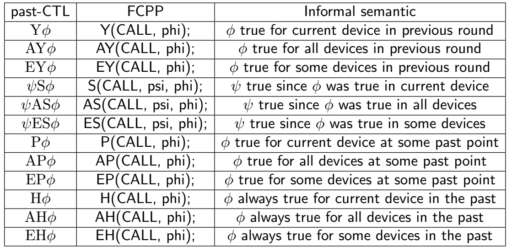

## Distributed Runtime Verification in Proximity-based Networks: A Tutorial on the Aggregate Programming Approach

**WORK IN PROGRESS**

### Installation

The next sections contain the setup instructions based on the CMake build system for the various supported OSs. Jump to the section dedicated to your system of choice and ignore the others.

#### Linux

Pre-requisites:
- Xorg-dev package (X11)
- G++ 9 (or higher)
- CMake 3.18 (or higher)
- Asymptote (for building the plots)
- Doxygen (for building the documentation)

To install these packages in Ubuntu, type the following command:
```
sudo apt-get install xorg-dev g++ cmake asymptote doxygen
```

If you are using **Wayland** the following additional packages must be installed:
```
sudo apt-get install libwayland-dev libxkbcommon-dev
```

In Fedora, the `xorg-dev` package is not available. Instead, install the packages:
```
libX11-devel libXinerama-devel.x86_64 libXcursor-devel.x86_64 libXi-devel.x86_64 libXrandr-devel.x86_64 mesa-libGL-devel.x86_64
```

Additionally for **Wayland** on Fedora you'll need the following packages:
```
wayland-devel libxkbcommon-devel
```

More detail on dependencies for distribution using Wayland are available at the following [link](https://www.glfw.org/docs/latest/compile_guide.html#compile_deps_wayland).

#### MacOS

Pre-requisites:
- Xcode Command Line Tools
- CMake 3.18 (or higher)
- Asymptote (for building the plots)
- Doxygen (for building the documentation)

To install them, assuming you have the [brew](https://brew.sh) package manager, type the following commands:
```
xcode-select --install
brew install cmake asymptote doxygen
```

#### Windows

For Windows we currently suggest to install a Ubuntu virtual machine capable of display a graphical environment, such as
Virtual Box.

On Windows the scripts used for building and launching the simulations do not provide all the functionalities and
some user action is required (more details can be found in the [notes](#notes)).

### Obtaining the source code

To retrieve the source code clone the repository with the following command:

```bash
git clone https://github.com/fcpp-experiments/past-ctl-monitoring.git
```

#### Build the demos

The repository contains the source code of simulations running past-CTL monitors to verify different properties.

Launching the bash script without additional input showcase the list of available
simulations:

```bash
./make.sh
```

To build and run the drone recognition example execute the following command:

```bash
./make.sh drone_recognition
```

### Running a simulation

When launching a simulation it is initially paused by pressing the **P key** you can pause/unpause the execution.

You can toggle the grid visualization with the **G key** and toggle the link
visualization with the **L key**.

You can move the view around using the **W,A,S,D keys** and increase or decrease
the zoom factor using the **Q,E keys**.

Simulation speed can be increased or decreased using the **I,O keys** and by pressing the **H key** or any unmapped key the help menu is presented pausing the
simulation. To exit from the help menu press the **P key** again.

By **clicking** on a node in the simulation is possible to inspect the current
state of the storage memory of a node.

***

### Reference pastCTL table



## Notes {#notes}

#### Windows

Due to the deprecation of certain functionalities on Windows 11, scripts have certain
limitations.

Limitation:

- After closing the GUI of the simulation, the user need to forcefully terminate the process from the terminal
- Plot generation requires additional work-around steps and must be run manually
- Additional steps are required to ensure that Asymptote correctly works on Windows, explained in this [link](https://asymptote.sourceforge.io/doc/Microsoft-Windows.html)


Pre-requisites:
- [MSYS2](https://www.msys2.org)
- [Asymptote](http://asymptote.sourceforge.io) (for building the plots)
- [Texlive](https://www.tug.org/texlive/windows.html#install) (Asymptote dependecy)
- [Ghostscript](https://www.ghostscript.com/releases/gsdnld.html) (Asymptote dependency)
- [Doxygen](https://www.doxygen.nl/) (for building the documentation)

At this point, run "MSYS2 MinGW x64" from the start menu; a terminal will appear. Run the following commands:
```
pacman -Syu
```
After updating packages, the terminal will close. Open it again, and then type:
```
pacman -Sy --noconfirm --needed base-devel mingw-w64-x86_64-toolchain mingw-w64-x86_64-cmake mingw-w64-x86_64-make git doxygen
```
The build system should now be available from the "MSYS2 MinGW x64" terminal.

For plot generation you need to install Asymptote, Texlive, Ghostscript.
Additionally for manual plot generation you need to:

- copy **plot.asy** from the **past-ctl-monitoring/plot** folder into **past-ctl-monitoring/output**
- from the "MSYS2 MinGW x64" terminal invoke asymptote using MinGW notation

```bash
cd output
/c/Program\ Files/Asymptote/asy smart_home.txt -textpath="C:\Program Files\Path" -f pdf
```

Where the **textpath option** must contain the path to the folder containing the **pdflatex** executable
installed by texlive.

To build and run the examples on Windows an additional argument is needed execute the following command:

```bash
./make.sh windows drone_recognition
```
